# [@deep-autoencoder-bot](https://t.me/deep_autoencoder_bot)

Учебный проект для курса Deep Learning (2018-2019) от [Deep Learning School](https://github.com/DLSchool/dlschool/). В нем реализована и обучена модель глубокого автокодировщика [deep autoencoder](https://towardsdatascience.com/applied-deep-learning-part-3-autoencoders-1c083af4d798) для лиц людей. Для обучения использовался датасет ["Labeled Faces in the Wild" (LFW)](http://vis-www.cs.umass.edu/lfw/). С помощью бота вы можете добавить/убрать улыбки людям из датасета LFW или на своём фото, а также посмотреть, во что нейросеть раскодирует случайные нормально распределенные вектора. Подробности в /help.

## Команды
### /random_img
> 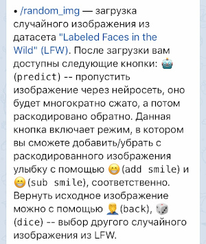
### Cлучайный человек из датасета
> 
### Добавляем ему улыбку
> 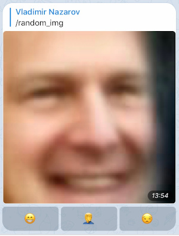

### /normal_code_img [mu] [sigma]
> 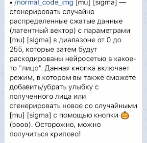
### Cлучайный "человек" сконструированный из нормального вектора
> 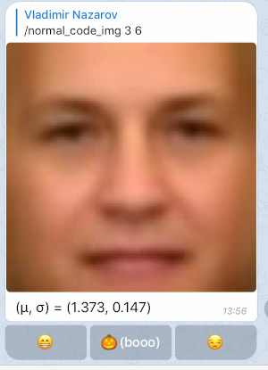
### Делаем менее улыбчивым...
> 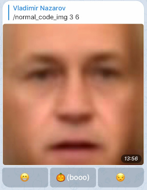
### Ещё случайный "человек"
> 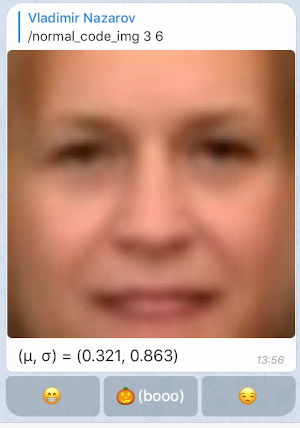
### Делаем более улыбчивым...
> 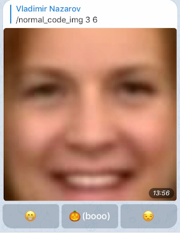
### Нажимаем кнопку boo..
> 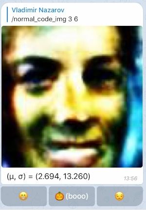
> 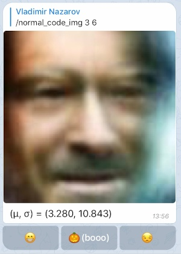

### /captured_usr_img
> 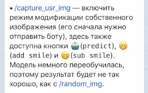
> 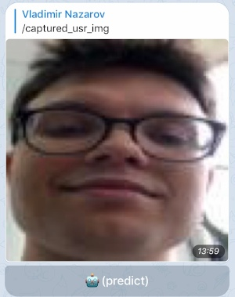
